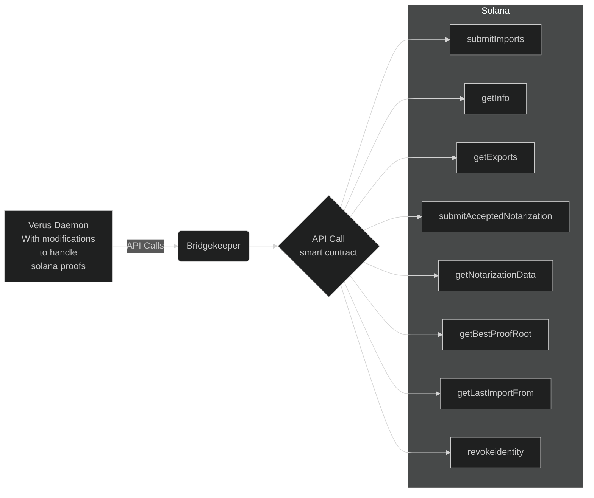

# Verus-Solana-Bridge 

Project to Define the scope of work and track the progress for the community Bounty Offered by Verus community members.

## Latest Update
Bounty started on Initial research Phase.

## Project synopsis

- [ ] 1. Rust RPC Server
    - [ ] 1.1 Handle API calls from the Verus Daemon
    - [ ] 1.2 Serialize and deserialize data
    - [ ] 1.3 Interact with Solana smart contract endpoints               
    - [ ] 1.4 Host a wallet to pay for Solana state change transactions
    - [ ] 1.5 Solana utility functions for Notarizers
- [ ] 2. Solana Smart Contracts
- [ ] 3. Daemon modification to accept Solana Proofs
- [ ] 4. Website so interact with Smart contract
- [ ] 5. Mobile app to interact with Solana and Verus 

#### Resources

(https://github.com/VerusCoin/VerusCoin)

(https://github.com/VerusCoin/Verus-Ethereum-Contracts)

(https://github.com/VerusCoin/Verusbridgekeeper)

(https://github.com/VerusCoin/VerusBridgeWebsite)

(https://github.com/VerusCoin/Verus-Mobile)

